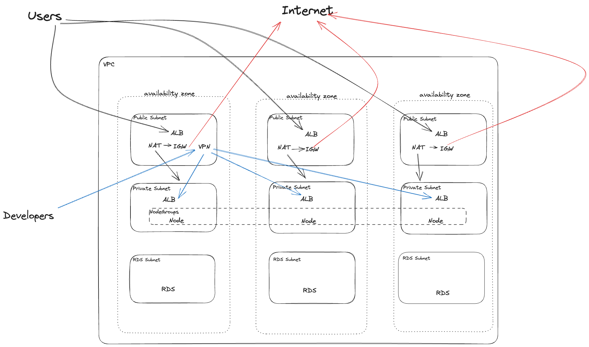
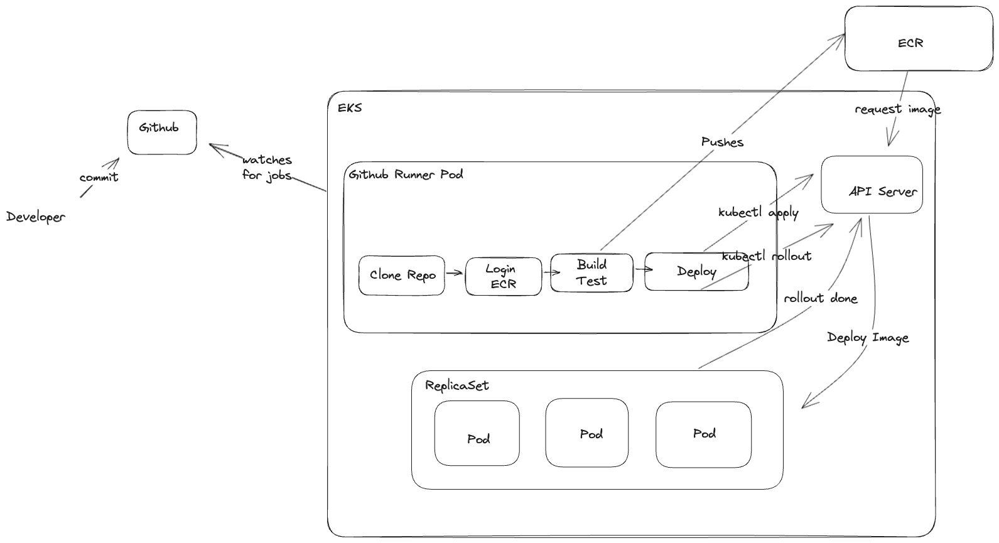
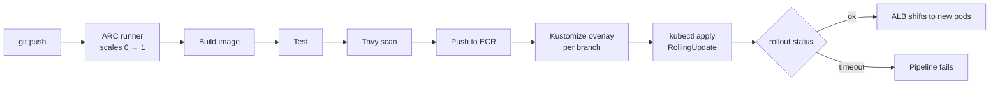
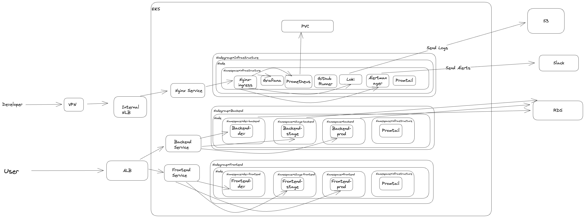

# EKS Platform Design: RealWorld app for millions of users

A platform design I wrote for a **DevOps Engineer take-home assessment** (August 2023). The brief was design only, no code: a document plus diagrams, defended later in the interview.

> 📦 **Moved from GitLab.** This was originally submitted on GitLab in 2023. It lives here now; the design and diagrams are unchanged, and the write-up has been cleaned up.

---

## 📋 The brief

> How do you design a **highly available, scalable, secure and cost-efficient** platform on AWS for continuously building, testing and deploying a [RealWorld](https://github.com/gothinkster/realworld) application to support **millions of concurrent users**?

The design had to cover:

1. **Automation:** deploying new code and running tests is fully automated.
2. **Logging:** logs from every tier are easy to reach and are not only stored on the hosts.
3. **Metrics:** historical metrics are kept so performance bottlenecks can be found and fixed.
4. **Disaster recovery:** the platform recovers from disasters quickly, with minimal or no data loss.
5. **Self-service:** engineers can deploy new applications with minimal help from DevOps.

It was judged on tool selection, how well the tools are used, and how flexible and extensible the solution is.

---

## 🧱 Stack

| Layer | Choice |
|---|---|
| App | ASP.NET (backend), Next.js (frontend), PostgreSQL |
| Compute | Amazon EKS, three node groups |
| Database | Aurora Serverless PostgreSQL, Multi-AZ |
| CI/CD | GitHub Actions + Actions Runner Controller on EKS, Kustomize |
| Registry & scanning | Amazon ECR, Trivy |
| Edge | ALB + AWS WAF, ACM certificates, ExternalDNS |
| Observability | kube-prometheus-stack (Prometheus, Grafana, Alertmanager → Slack), Loki on S3, Promtail |

### Why EKS?

| Option | Verdict |
|---|---|
| **ECS** | Works well, but it ties the platform tightly to AWS. |
| **EC2 + Auto Scaling Groups** | Needs custom scripts for deployment and scaling, which means more to build and maintain. |
| **EKS** ✅ | Kubernetes abstractions (Ingress, Service, LoadBalancer) are portable, so moving to another cloud later mostly means changing controllers rather than rewriting the platform. |

---

## 🏗️ Architecture

**Network**
- One VPC across **3 AZs**, each with a public, a private and a database subnet.
- Private subnets are **/19 or larger** (8,000+ IPs each) so pod networking doesn't exhaust IPs.
- Internet Gateway for public traffic; one **NAT Gateway per AZ** for private egress.
- Subnets are tagged so the AWS Load Balancer Controller places public ALBs in public subnets and internal ones in private subnets.

**Cluster**
- Three labelled node groups, **Frontend**, **Backend** and **Infrastructure**, so workloads are pinned with node selectors and can scale independently.
- Instance types are chosen with enough ENIs for the expected pod density.
- Add-ons:

| Add-on | Purpose |
|---|---|
| AWS Load Balancer Controller | Public ALB for Ingress |
| ingress-nginx | Internal ingress for tools, reached over VPN |
| cert-manager | TLS certificates |
| ExternalDNS | DNS records from Ingress |
| Cluster Autoscaler + Metrics Server | Node autoscaling + HPA |
| Calico | Network policies between namespaces |

**Database:** Aurora Serverless PostgreSQL in its own Multi-AZ subnets, fully managed by AWS.

---

## 🚀 Application deployment

Environments are **dev**, **stage** and **prod**, each in its own namespaces, isolated with network policies. Frontend talks to backend through an internal Service.

On the **first** deploy of a new app, the platform does the rest by itself: ExternalDNS creates the record, the AWS LB Controller creates the ALB with an ACM certificate and WAF rules, and the Cluster Autoscaler adds nodes if needed. That's the self-service part: a developer adds a Kustomize overlay and pushes.

---

## 📈 Monitoring & logging

- **Metrics:** kube-prometheus-stack. Apps expose `/metrics` and are picked up with a `ServiceMonitor`. Prometheus keeps history on a persistent volume.
- **Alerts:** Alertmanager → Slack.
- **Logs:** Promtail runs as a DaemonSet on every node and ships to **Loki**, which stores chunks in **S3**, so logs never live only on the hosts.
- **Database:** CloudWatch.
- **Access:** Grafana and the other tools sit behind the internal ingress, reachable only over VPN.

---

## ✅ Requirements → design

| Requirement | How it's met |
|---|---|
| Automated build, test, deploy | GitHub Actions on autoscaling ARC runners; build → test → Trivy → ECR → Kustomize → rollout check |
| Logs off the hosts | Promtail → Loki, stored in S3 |
| Historical metrics | Prometheus with persistent storage, Grafana dashboards |
| Disaster recovery | Multi-AZ everywhere; stateless workloads redeployed from Git and ECR. *Backups and restores were thin in the original; see below.* |
| Developer self-service | New app = Kustomize overlay + push; DNS, TLS, load balancer and scaling are automatic |
| Secure | Private nodes, WAF on the ALB, image scanning, network policies, tools only over VPN |
| Cost-efficient | Aurora Serverless scales with load; runners scale to zero; node groups scale independently |

---

## 🔁 What I'd change today (2026)

Looking back at this three years later:

| 2023 design | Today | Why |
|---|---|---|
| `kubectl apply` from the pipeline | **Argo CD** (GitOps) | Git becomes the source of truth, drift is visible, and rollback is a revert |
| Cluster Autoscaler | **Karpenter** | Faster scaling, picks the right instance types, uses Spot easily |
| Promtail | **Grafana Alloy** or Fluent Bit | Promtail is deprecated |
| Implicit AWS credentials in CI | **GitHub OIDC → IAM roles** | No long-lived keys in the pipeline |
| VPC, EKS and DB described, not coded | **Terraform** modules + pipeline | Repeatable environments and reviewable changes |
| DR mostly from Multi-AZ | **Velero** + cross-region Aurora snapshots, tested restores | A backup you haven't restored isn't a backup |
| Single cluster, namespaces per env | Separate **prod** cluster | Blast radius, and upgrades tested on non-prod first |
